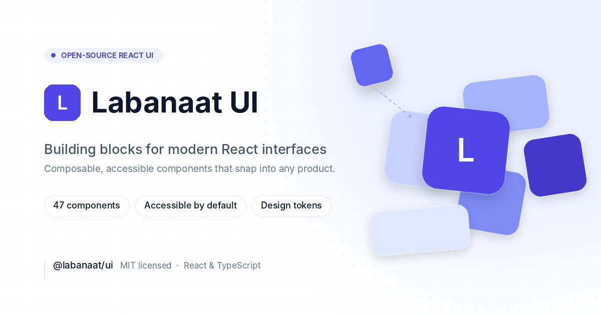

<p align="center">
  
</p>

<h1 align="center">Labanaat UI</h1>

<p align="center">
  A production-grade, composable React component library — accessible by
  default, themeable to the token, and built to feel like one product
  instead of forty-seven separate ones bolted together.
</p>

<p align="center">
  <a href="https://www.npmjs.com/package/@labanaat/ui"></a>
  <a href="./LICENSE"></a>
  
</p>

---

## What is Labanaat UI?

Labanaat (لبنات) means **"building blocks"** in Arabic — a fitting name
for a library built around real, composable pieces rather than a wall of
configuration props.

It's a full React component platform, not just a button and a modal:

- **47 components**, from foundational (Button, Input, Card) through
  application-shell (Sidebar, Navbar, CommandPalette) to genuinely
  advanced (Kanban with real drag-and-drop, DataGrid with resizable
  columns, Chart, Calendar with range selection).
- **Accessible by construction.** Complex patterns — Dialog, Select,
  Combobox, Tabs — use [Radix Primitives](https://www.radix-ui.com/)
  internally for keyboard/focus behavior that's been proven across
  thousands of production apps; where no primitive exists (Combobox,
  Calendar), the WAI-ARIA pattern is implemented directly instead of
  reaching for an unmaintained dependency.
- **Themeable down to the token.** Every color, radius, shadow, and
  spacing value resolves to a CSS variable defined once. Rebrand an
  entire app by overriding a handful of variables — no component code
  changes required.
- **Documented with live, editable code**, not static screenshots — every
  component's docs page lets you edit the example and see it re-render,
  instantly, in the browser.
- **Proven in three real, full applications**, not just component demos —
  see [Templates](#templates) below.

## Quick start

```bash
npm install @labanaat/ui
```

```tsx
import { Button } from "@labanaat/ui/button";
import "@labanaat/ui/styles.css";

export function App() {
  return <Button onClick={() => console.log("Hello, Labanaat.")}>Get started</Button>;
}
```

Every component ships its own entry point (`@labanaat/ui/<component>`),
so you only bundle what you actually import — no barrel-file tax. One
stylesheet import, no provider wrapping required to get started.

Want to change the whole app's accent color? Override the token:

```css
:root {
  --ui-primary: #7c3aed;
}
```

Full installation, theming, accessibility, and localization guides live at
[`/docs`](https://labanaat.com/docs/introduction) once deployed, or run
the docs site locally — see [Development](#development) below.

## What's included

**Foundational** — Button, Badge, Avatar, Spinner, Card, Alert, Skeleton, Separator
**Form** — Input, Textarea, Checkbox, Switch, RadioGroup, Select, Combobox, DatePicker, Slider, FileUpload
**Navigation** — Tabs, Pagination, Breadcrumbs, Accordion
**Overlay** — Dialog, Drawer, Popover, Tooltip, DropdownMenu
**Feedback / data display** — Toast, ProgressBar, EmptyState, Table
**Application** — Sidebar, Navbar, NavigationMenu, Stepper, Timeline, CommandPalette, DataTable, Carousel, Calendar, Metric
**Advanced** — Kanban, FilterBuilder, ActivityFeed, FileManager, DataGrid, Chart

Every component has real, dedicated tests, an accessibility sweep against
`axe-core`, a live documentation page, and full TypeScript types.

## Templates

Not component demos — three complete, real applications, each built
entirely from this library, living at `/templates` on the docs site:

- **Analytics Dashboard** — a metrics-first SaaS dashboard: charts, a
  sortable data table, top-line KPIs.
- **Project Board** — a Trello/Linear-style workspace: a real
  drag-and-drop Kanban board, a guided new-project flow, an activity log.
- **Team Workspace** — a files-and-scheduling hub: a file/folder browser,
  a booking calendar, instant search via a command palette.

Every template ships its own "View source" panel, so you can see exactly
how each page is built — no separate repo to clone.

## Architecture principles

- **Library-first.** `packages/ui` has zero dependency on the landing
  site or templates — they depend on it, via `workspace:*`, exactly like
  an external consumer would via npm.
- **Radix stays an implementation detail.** Consumers get Labanaat's own
  props and styling; Radix (or `cmdk`, `embla-carousel-react`,
  `@dnd-kit`, `@tanstack/react-table`, `recharts`, where used) never
  leaks into the public API surface.
- **Tokens over hardcoded values.** Every visual value reads from a CSS
  variable defined once in `src/styles/index.css`. Theming never touches
  component code.
- **Composition over configuration.** `Card`, `Dialog`, `Drawer`,
  `Accordion`, and similar components expose subcomponents/slots instead
  of large prop surfaces.
- **Centralized, localizable content.** All component-generated copy
  flows through `useUiContent()` / `<UiContentProvider>`.
- **Tree-shakeable by construction.** One build entry per component
  folder — `@labanaat/ui/button` ships only Button and its direct
  dependencies.
- **Honest, documented trade-offs.** `DatePicker` deliberately uses the
  native `<input type="date">` instead of a custom calendar grid — the
  reasoning (and the more powerful `Calendar` component, which does
  support a full grid with range selection) is on its docs page, not
  hidden.

## Development

```bash
pnpm install
pnpm dev              # library watcher + the docs/templates site, in watch mode
pnpm test             # unit + interaction tests (Vitest + Testing Library)
pnpm test:a11y        # axe-core accessibility assertions
pnpm lint             # ESLint across the whole monorepo
pnpm build            # production build of the library + site
pnpm --filter landing dev   # docs + templates site only, at localhost:3000
```

```
labanaat-ui/
├── packages/
│   └── ui/                    # @labanaat/ui — the component library
│       ├── src/
│       │   ├── components/    # one folder per component (Component.tsx, index.ts, tests)
│       │   ├── primitives/    # low-level building blocks
│       │   ├── tokens/        # typed access to the CSS-variable design tokens
│       │   ├── hooks/         # useControllableState, useFocusTrap, useUiId
│       │   ├── content/       # localization / centralized UI text registry
│       │   ├── utils/         # cn() class merging
│       │   ├── test/          # shared test setup + cross-component a11y sweep
│       │   └── styles/        # index.css — the token source of truth
│       └── tsup.config.ts     # per-component build entries for tree-shaking
├── apps/
│   └── landing/                # docs site + /templates gallery (Next.js + MDX)
└── .github/workflows/          # CI (build/lint/test/a11y/package-verify) + release
```

## Quality bar

47 components · 38 test files, 189 tests · accessibility sweep across 40
components · full-repo TypeScript strict mode · CI runs lint, typecheck,
tests, the a11y sweep, and a real `npm pack` + fresh-install verification
on every change (not just an in-monorepo build). Full history of what's
shipped, what was fixed along the way, and what's still open lives in
[`packages/ui/CHANGELOG.md`](./packages/ui/CHANGELOG.md).

**Currently shipping as `0.9.0`** — the library and its testing are
solid, but the newest component batch hasn't had a full real-browser QA
pass yet. `1.0.0` follows that pass.

## Troubleshooting

**`pnpm dev` cold start** — the library's watcher (`tsup --watch`) needs
a few seconds to produce its first build before `dist/styles.css`
exists. If you load a page in the first ~5–10 seconds and see a
transient `Module not found: @labanaat/ui/styles.css`, refresh — it
won't recur for the rest of the session.

**Google Fonts fetch fails during build** (corporate proxy, air-gapped
CI) — `apps/landing/app/layout.tsx` uses `next/font/google`. If your
network can't reach `fonts.googleapis.com`, swap those imports for
`next/font/local` with self-hosted files, or a system font stack.

## License

MIT — see [`LICENSE`](./LICENSE).
